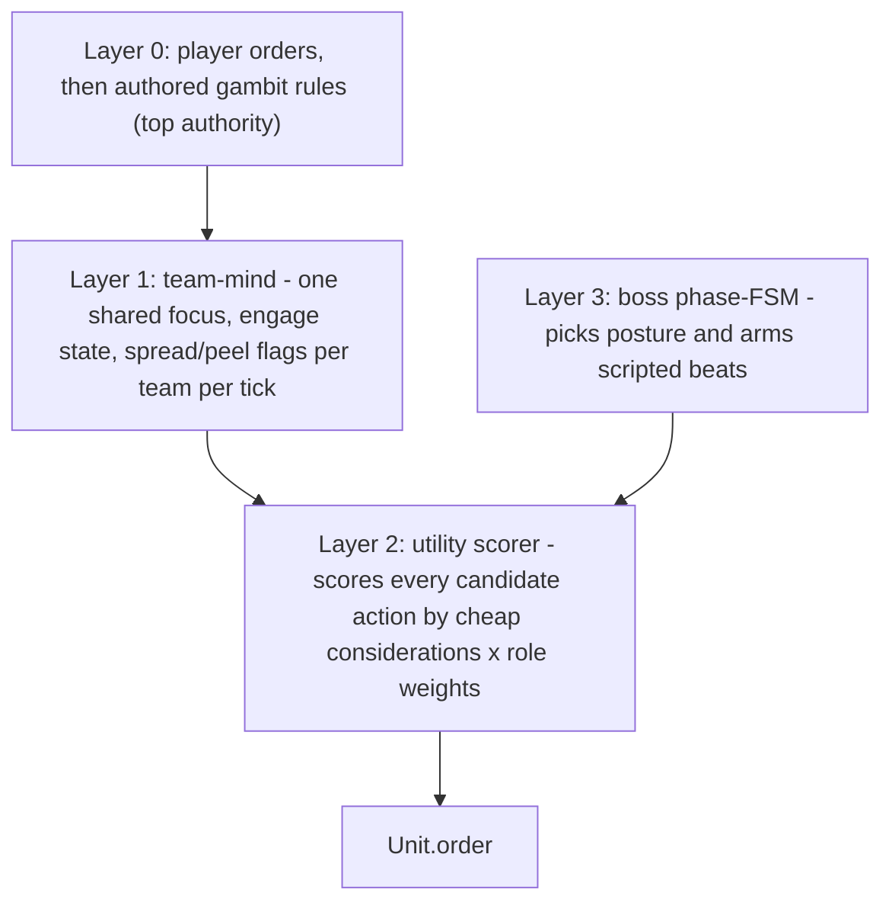

# AI OVERHAUL — a brain for the autobattler, team fights, and raids

How the combat AI stops being a blob that walks forward and trades, and starts playing like a team that knows what it is. Companion to `SPEC.md` (§1.1 controllers, §4 raids, §7 macro), `COMBAT_OVERHAUL.md` (which connected the player's hands to the sims), and `PROGRESS.md`.

Same footing as the rest of the project. The headless deterministic core (`src/core/`) stays the system of record. It never imports `three`, never touches the DOM, and stays deterministic for a seed. `COMBAT_OVERHAUL.md` did the control work: the combat context, the real Captain's Call, and the live raid session all landed. This document records the brain underneath all of it. The implementation is additive, data-driven, and reversible. The boundary test (`src/test/boundary.test.ts`) stays green and the headless auto-resolve paths stay the tested reference.

---

## 0. SHIPPED STATE

The control plumbing from `COMBAT_OVERHAUL.md` is in place, and the brain work in this file has landed. The old slot-order ability routine and private low-HP target picker have been replaced by a shared utility scorer, combat profiles, and team-mind targeting. Creeps, gambit heroes, and bosses all route through the same scorer where authored orders leave the move open.

The gambit grammar now includes the missing positioning and reactive pieces: `kite`, `dodge-zones`, `focus-fire`, `most-dangerous`, `enemy-casting`, `enemy-cast-seen`, `self-disabled`, and `incoming-disable`. The editor exposes them by category. Default gambits are role-shaped guardrails, and the scorer handles kit-aware offense, saves, item use, kiting, and focus.

Threat has been rebuilt around the raid contract in `SPEC.md` §4. Damage and effective healing generate threat, role multipliers let tanks hold aggro, melee and ranged pull thresholds stop target jitter, taunt raises the tank to the top of the table, and threat drops are attached to save tools such as Smoke and Glimmer Cape.

Raid bosses have a phase brain. The boss chooses a posture by phase, uses threat or opportunity to pick targets, can fire survival and interrupt items, and arms scripted mechanics through the same raid mechanic runner used by headless and live raids. Raid allies now dodge, scatter, stack for a ready heal, peel adds off the backline, and burn during enrage.

---

## 1. THE MODEL — a hybrid brain, settled

The proven pattern for this kind of agent is the one Valve's own Dota bots use and the one most combat AI converged on: a thin outer layer that decides what mode you are in, and a utility scorer inside that mode that decides the moment-to-moment action. Valve's bots score each mode's desire from 0 to 1 and run the highest; ability and item use are separate "consider" functions that return a desire and a target. We adopt the same shape, layered so authored intent always wins and the core stays deterministic.

- **Layer 0 stays as it is.** Player orders win first. Then the gambit rule list, the readable FF12-style list the editor builds. A rule that fires still decides the action. The scorer only runs when no rule pins the move, which today is the spot that falls back to "attack focus."
- **Layer 1, the team-mind, is new.** A small struct on `Sim`, computed once per team per decision tick. It picks one shared focus for the team, tracks an engage state (hold until the initiator commits, then everyone bursts), and raises context flags (an enemy area effect is up, so spread; enemy burst is loaded, so do not dive). This is the team-desires idea from the bot model, scaled to a 5v5.
- **Layer 2, the utility scorer, is the heart.** When the move is open, it enumerates candidate actions (cast this ability at that target, use this item, attack the focus, kite, peel to a diving ally, step out of a zone) and scores each one from a handful of cheap considerations: range, cooldown, mana, expected value against the target, how many units an area effect would catch, whether an ally is in danger, how much threat headroom the caster has. The highest score becomes the order. One scorer serves creeps, gambit heroes, and the boss. The per-role and per-attribute weights are where a hero's character lives.
- **Layer 3, the boss phase-FSM, is new.** A short machine (opening, sustained, health sub-phases, enrage, desperation) selects a posture, which is a set of scorer weights plus the beats that are armed in that phase. Inside a phase the boss uses the same scorer to choose targets and casts. It can hold its big area effect until the party clusters, swing to the healer when threat allows, or interrupt a clutch channel.

Everything stays a pure function of sim state with data-driven weights. The scorer reads positions, health, cooldowns, and statuses, all deterministic. Ties break by uid. Boss variety comes from the seeded `sim.rng`, so a replay of the same seed is identical.

---

## 2. PILLAR ONE — the autobattler (gyms, Elite Five, auto-resolve)

Gyms and the Elite Five keep pure-Dota parity, per `SPEC.md` §4 and §10. Both sides field the same upgraded brain, fixed and symmetric. The depth-as-difficulty lever in §4 below stays out of the gym layer so competitive feel is clean.

- Ability, item, and target choice route through the Layer 2 scorer, which retires slot-order firing. A nuker now leads with its burst on the right target instead of its first-listed spell on the nearest body.
- Reactive considerations let a gambit answer a play: `enemy-cast-seen` with a category (blink, ult, channel) is the trigger `SPEC.md` §7 named, plus `self-disabled` and `incoming-disable`. These enable "BKB when their initiator ults" and "save the ally being dived."
- Item actives get their own consider functions, the way the bot model gives each item a desire: BKB on a hard disable, Force Staff to escape or chase, Glimmer to save, Mekansm on a wounded cluster, Eul on the blink-in.
- The headless `runGymMatch` and the live fight share `LiveGymFight`, so both inherit the brain with no extra wiring, and the auto-resolve stays the balance reference.

## 3. PILLAR TWO — team fights and characteristics

A unit should fight like itself. Its character comes from four things it already carries: its role, its attribute, its attack range, and the shape of its kit.

- A `combatProfile`, derived from `HeroDef.roles`, `attribute`, `baseStats.attackRange`, and ability targeting tags, produces a weight set and a preferred posture (frontline, midline, backline). A carry kites, holds attack range, and rides the threat ceiling. A nuker bursts the most dangerous target. A support peels, saves, and zones. An initiator holds until the opening, then commits. A durable hero fronts and soaks. The profile is data the scorer reads, so behavior reads as Sven, Crystal Maiden, or Tidehunter without a line of per-hero AI code.
- The team-mind delivers the combo. A shared focus makes five heroes converge, and the engage state sequences the wombo: the initiator lands the opener, the team pours burst onto the shared focus, the support holds a save. Spacing reacts to the enemy composition, so a team spreads against area threats.
- Counterplay reads come from the same considerations: focus the enemy support, peel your carry off their initiator, scatter against a Tidehunter.
- The vocabulary stays closed, the scope guard from `COMBAT_OVERHAUL.md` §3.2. Characteristics are weights, postures, and considerations, not bespoke scripts. A behavior that seems to need a custom script gets redesigned as a consideration plus a weight.

## 4. PILLAR THREE — raids

- **The threat model is rebuilt** on the WoW-style rules `SPEC.md` §4 already points at. Damage adds threat one for one. Effective healing adds threat at half rate, credited to the healer, with no threat for overheal. A tank role carries a threat multiplier so a front-liner holds aggro on equal effort. Aggro thresholds stop the jitter: a new target has to beat the current top by a margin (more for a ranged attacker than a melee one) before the boss swaps, which is the "threat ceiling" the carry rides. A taunt sets the tank's threat equal to the current top instead of only overriding for a moment, so it buys a real lead. Select items and abilities drop threat. Decay stays off by default and is opt-in per encounter. The model generalizes past the boss so future elite packs reuse it.
- **The boss gets the Layer 3 brain.** It targets by threat and by opportunity, holding an area effect for a cluster, swinging to a reachable healer, interrupting a channel, and repositioning. Seeded weighted choices give attempt-to-attempt variety while a replay stays deterministic. The scripted beats stay, now armed and initiated by the phase machine rather than fired blindly by health threshold.
- **The party plays the mechanics.** The four allies you do not drive get raid-aware considerations: step out of the telegraph, peel adds off the backline, stack for the heal, scatter for the signature, and burn during enrage. They read like a competent group instead of five blobs.
- **Difficulty becomes depth, for raids and overworld elites only.** Higher tiers sharpen the brain (more reactivity, tighter coordination, sharper posture), a lever beside the existing `hpScale` and `damageScale` in `src/core/macro.ts`. Gyms and the Elite Five stay on the fixed symmetric brain.
- `runRaidEncounter` stays headless and authoritative and keeps driving the raid tests and the M10 playthrough. `LiveRaid` in `src/systems/raid-session.ts` shares the same brain. Live raid numbers get a re-tune once the encounter is played by a person dodging telegraphs, with the headless encounter held as the balance reference.

---

## 5. ARCHITECTURE — what touches what

Core modules, all headless and deterministic:

- `src/core/combat-profile.ts` derives and caches a `CombatProfile` from role tags, attribute, attack range, and kit shape.
- `src/core/utility.ts` owns the action scorer, reactive reads, item considers, raid ally considerations, and `computeTeamMind`.
- `src/core/sim.ts` stores `TeamMind` and recomputes it through `Sim.teamMind()` on a fixed cadence.
- `src/core/threat.ts` owns threat generation, pull thresholds, taunt-to-top, drops, and opt-in decay.
- `src/core/boss-brain.ts` owns the boss phase machine, posture targeting, seeded variety, and mechanic selection.

`src/core/controllers.ts` is now the orchestrator. `thinkGambit`, `thinkCreep`, and `thinkBoss` acquire focus, honor authored actions, then call the scorer where the old code used to fall through to slot-order ability use or a plain attack. `src/core/types.ts` carries the expanded gambit grammar. `src/core/combat.ts` credits damage and healing threat through `src/core/threat.ts`. `src/core/macro.ts` wires the boss AI-depth knob and lets the boss brain choose armed raid mechanics.

Systems, engine, and UI stayed small. The gym and raid sessions share their headless engines, so they inherit the brain through the core. The gambit editor in `src/ui/hud.ts` lists the new conditions and actions by category. No `GameSave` change was needed: the grammar additions are new union variants, so saved gambits keep loading.

---

## 6. PHASING — shipped slices

- **A0 — the scorer.** Done. `combat-profile.ts` and `utility.ts` route creep, boss, and gambit fallbacks through value-scored actions. `src/test/utility-ai.test.ts` covers profiles, cast value, target choice, team focus, spread, hold, and determinism.
- **A1 — the team-mind.** Done. `TeamMind` lives on `Sim`, carries shared focus, engage state, and spread, and is tested through team convergence and flag-driven decisions.
- **A2 — reactivity.** Done. `enemy-cast-seen`, `self-disabled`, `incoming-disable`, and item-active consider functions ship, with editor exposure and `src/test/reactive-ai.test.ts`.
- **A3 — characteristics.** Done. Combat profiles and role-true `buildDefaultGambit` drive defaults, with `src/test/default-gambit-sweep.test.ts` guarding the seed sweep against the old defaults.
- **A4 — threat.** Done. Healing threat, role multipliers, aggro thresholds, taunt-to-top, threat drops, and opt-in decay are in `src/core/threat.ts`, covered by `src/test/threat.test.ts`.
- **A5 — boss brain.** Done. `src/core/boss-brain.ts` handles phase, posture, seeded variety, and mechanic choice. Boss-controlled item actives now cover survival and interrupts.
- **A6 — raid party and difficulty.** Done. Raid allies dodge, scatter, stack for Mekansm, peel adds, and burn enrage. Raid tier dials boss `aiDepth`, and `src/test/raid-ai.test.ts` checks live versus headless agreement.

Cross-cutting gate for future AI edits: keep `npm test` and `npm run build` green, keep `boundary.test.ts` green, preserve determinism, and keep the headless paths as the balance reference.

---

## 7. SETTLED DECISIONS

1. **Suppression boundary.** A fired gambit rule decides the action. The scorer fills the open move only when no authored rule fires.
2. **Boss variety versus determinism.** Boss posture variety uses seeded choices forked from `sim.rng`, so identical seed and state replay identically.
3. **Threat decay.** Decay is off globally and available as an opt-in helper for encounters that want it.
4. **Editor load.** The rule list stays grouped by category, and default presets remain the on-ramp.

---

## 8. PRINCIPLES (consistent with `SPEC.md` §10 and `COMBAT_OVERHAUL.md` §8)

- **Authored intent wins.** Player orders, then gambit rules, then the scorer. The brain fills gaps; it never overrides a decision the player made.
- **Character comes from data.** A hero fights like itself because of its role, attribute, range, and kit, read as weights. No per-hero AI code.
- **One brain, many drivers.** Creeps, gambit heroes, and bosses share the scorer. Gyms and raids share it through the engines they already share.
- **Keep the core headless and deterministic.** Every layer is a pure function of sim state with seeded randomness only where variety is wanted. `boundary.test.ts` stays green.
- **Additive and reversible.** Auto-resolve stays for gyms and raids. The headless paths stay the tested reference. The base game is never worse for any of this existing.
- **Ship slices.** A0 lifts every fight on its own. Each later slice stands alone and stays green.
